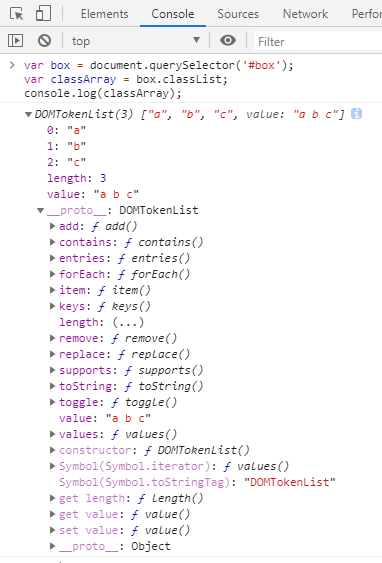
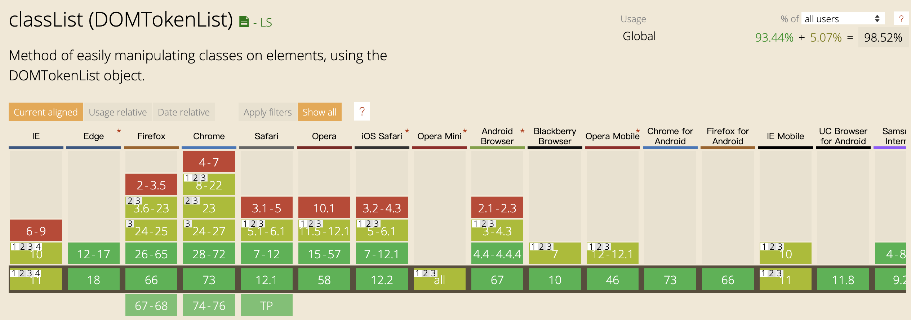

# 实现一个 classList

> 不用 jquery 也可以愉快的操作类名了！

原生DOM API classList 提供了很方便的操作元素类名的方法（add, remove, toggle 等），但美中不足的是，仅支持 IE10 以上。

因此这里封装一个兼容良好的 zClassList API，与原生 API 保持相同的调用方式（包括函数名，参数和返回值，统统一致）。


使用方法：直接引入 classList.js 即可。


## classList 是什么

`classList` 是 HTML5 中用于用于操作 DOM 元素类名的 API。

假设页面有这样一个元素

```html
<div id="box" class="a b c"></div>
```

在 chrome 中打印它的 classList 

```js
var box = document.querySelector('#box')
var classArray = box.classList
console.log(classArray)
```



可以看到 classList 是一个类数组的数据结构，每一项元素都是一个类名，length 属性表示元素类名的个数。

### 以下是常用 API：
+ **item()**

item() 支持一个参数，为类名的索引，返回对应的类名：

```js
classArray.item(0);  // a
```

如果索引超出范围，则返回 undefined。

+ **添加类名 add()**

add() 方法接收**一个或多个类**名字符串参数，表示往类名列表中添加一个或多个类名。如果之前类名存在，则忽略此类名添加。

```js
classArray.add('blue')

classArray.add('blue', 'red')
```

+ **移除类名 remove()**

与 add() 方法相似，remove() 也接收**一个或多个**类名字符串参数，但是其意义正好相反，remove() 表示往类名列表中移除一个或多个类名。如果类名不存在，则忽略此类名的移除。

```js
classArray.remove('red')

classArray.remove('a', 'b')
```

+ **判断是否包含某个类名**

contains() 方法接收一个类名字符串参数，判断类名列表中是否包含此类名，如果包含返回 true，否则返回 false。

```js
classArray.contains('red')
```

+ **替换类名 replace()**

replace() 方法接收两个个类名字符串参数，用第二个类名替换第一个类名。如果原类名列表并不存在第一个类名，则替换失败返回false，反之则替换成功，返回true，

```js
classArray.replace('xxx', 'yyy')
```


+ **切换类名 toggle()**

toggle() 方法接收一个类名字符串参数，如果类名列表中已经存在此类名，则删除它，然后返回false；如果不存在此类名，则添加它，然后返回 true。

```js
classArray.toggle('green')
```

toggle() 方法还可以接收第二个参数，如果第二个参数为 true，则添加类名，并返回 true，反之删除类名并返回 false

```js
classArray.toggle('fl', 20 > 10)
```


## classList 兼容性

在下图中可以看出，`classList` 仅支持 IE10+ 和 安卓 3.0 以上版本。



[classList 兼容性](https://caniuse.com/#search=classList)